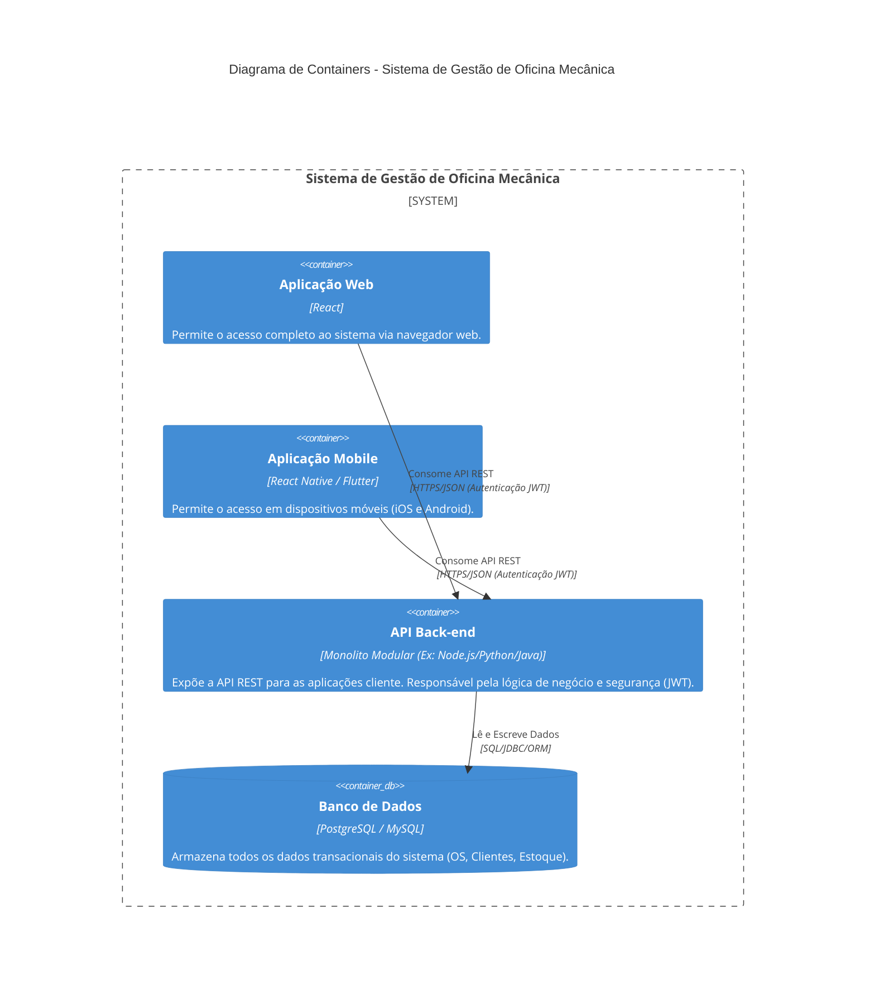

# Arquitetura do Sistema de Gestão de Oficina Mecânica

Este documento descreve a arquitetura de alto nível (Nível de Containers do Modelo C4) do Sistema de Gestão de Oficina Mecânica, detalhando as principais decisões tecnológicas para o desenvolvimento do MVP.

## 1. Decisões Arquiteturais

| Componente | Decisão | Justificativa |
| :--- | :--- | :--- |
| **Back-end** | Monolito Modular | Ideal para projetos acadêmicos e MVPs. Permite um desenvolvimento mais rápido e coeso, mantendo a organização lógica através de módulos (Pedidos, Clientes, Estoque, etc.). |
| **Comunicação** | API REST | Padrão de comunicação leve e amplamente adotado, facilitando a integração com múltiplos clientes (Web e Mobile). |
| **Autenticação** | JWT (JSON Web Tokens) | Mecanismo seguro e *stateless* para autenticação e autorização, essencial para APIs REST e aplicações desacopladas. |
| **Front-end Web** | React | Framework moderno e popular, escolhido pelo usuário, que permite a construção de interfaces de usuário dinâmicas e reativas. |
| **Front-end Mobile** | Aplicação Nativa/Híbrida (consumindo a mesma API) | Reutiliza a lógica de negócio do Back-end, garantindo consistência de dados e reduzindo o esforço de desenvolvimento. |
| **Banco de Dados** | Relacional (Ex: PostgreSQL ou MySQL) | Adequado para sistemas de gestão que exigem integridade transacional e relacionamentos complexos entre entidades (OS, Clientes, Peças). |

## 2. Diagrama de Containers (C4 - Nível 2)

O diagrama a seguir ilustra os principais containers de software que compõem o sistema e como eles interagem.

## 3. Detalhamento das Interações

1.  **Aplicações Cliente (Web e Mobile) <-> API Back-end:**
    *   Ambas as aplicações consomem a mesma API REST.
    *   A comunicação é segura, utilizando o protocolo **HTTPS**.
    *   A autenticação é realizada via **JWT**, onde o token é enviado em cada requisição para validar a identidade e as permissões do usuário.
2.  **API Back-end <-> Banco de Dados:**
    *   O Back-end é o único componente com acesso direto ao Banco de Dados.
    *   A comunicação é interna e utiliza drivers ou ORMs (Object-Relational Mappers) para persistir e recuperar os dados.
    *   O Back-end garante a integridade e a consistência dos dados, seguindo as regras de negócio definidas nos Requisitos Funcionais.