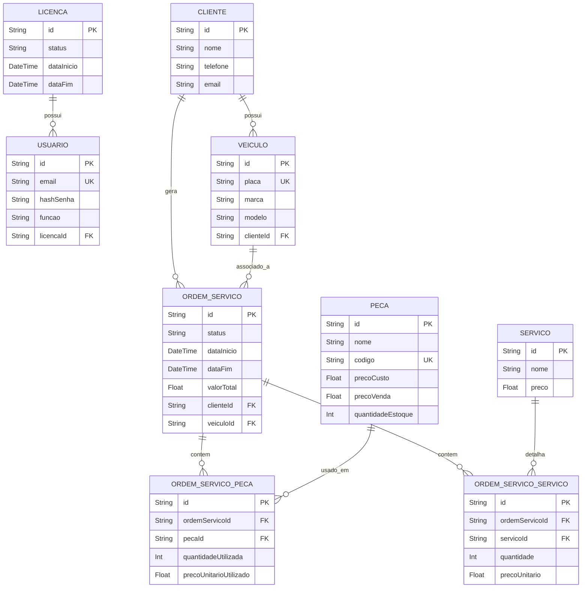

# Modelagem de Dados - Sistema de Gestão de Oficina Mecânica (MVP)

A modelagem de dados é crucial para garantir a integridade e a eficiência do sistema. Baseando-se nos Casos de Uso definidos e na arquitetura de Back-end com **Prisma**, a modelagem a seguir adota a **Terceira Forma Normal (3FN)** para evitar redundância e anomalias de atualização.

## 1. Diagrama Entidade-Relacionamento (DER)

O diagrama abaixo ilustra as principais entidades e seus relacionamentos.

## 2. Normalização e Entidades Principais

A modelagem foi estruturada em torno da entidade central **Ordem de Serviço (OrdemServico)**, que se relaciona com as demais entidades.

| Entidade | Propósito | Chaves e Relacionamentos |
| :--- | :--- | :--- |
| **Licenca** | Gerencia a licença mensal do usuário. | Chave Primária: `id`. Relacionamento 1:N com `Usuario`. |
| **Usuario** | Armazena dados de autenticação e perfil. | Chave Primária: `id`. Chave Estrangeira: `licencaId` (para `Licenca`). |
| **Cliente** | Cadastro de clientes. | Chave Primária: `id`. Relacionamento 1:N com `Veiculo` e `OrdemServico`. |
| **Veiculo** | Cadastro de veículos dos clientes. | Chave Primária: `id`. Chave Estrangeira: `clienteId` (para `Cliente`). |
| **OrdemServico** | O coração do sistema. Representa a Ordem de Serviço. | Chave Primária: `id`. Chaves Estrangeiras: `clienteId`, `veiculoId`. |
| **Peca** | Cadastro e controle de estoque de peças. | Chave Primária: `id`. Chave Única: `codigo`. |
| **Servico** | Cadastro de serviços padronizados. | Chave Primária: `id`. |
| **OrdemServicoPeca** | Tabela de ligação N:M entre `OrdemServico` e `Peca`. | Armazena a quantidade e o preço unitário da peça no momento da OS (histórico). |
| **OrdemServicoServico** | Tabela de ligação N:M entre `OrdemServico` e `Servico`. | Armazena a quantidade e o preço unitário do serviço no momento da OS (histórico). |

## 3. Chaves Estrangeiras e Integridade

As chaves estrangeiras garantem a integridade referencial:

*   **Usuario** referencia **Licenca**.
*   **Veiculo** referencia **Cliente**.
*   **OrdemServico** referencia **Cliente** e **Veiculo**.
*   **OrdemServicoPeca** referencia **OrdemServico** e **Peca**.
*   **OrdemServicoServico** referencia **OrdemServico** e **Servico**.

O uso de tabelas de ligação (`OrdemServicoPeca` e `OrdemServicoServico`) é essencial para a **normalização**, pois permite que uma OS tenha várias peças/serviços e que uma peça/serviço pertença a várias OSs. Além disso, essas tabelas armazenam dados transacionais (preço e quantidade usados na OS), que podem ser diferentes dos valores atuais nas tabelas `Peca` e `Servico`.
